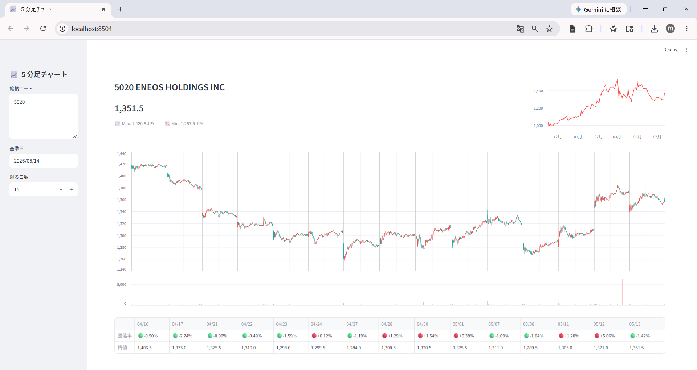
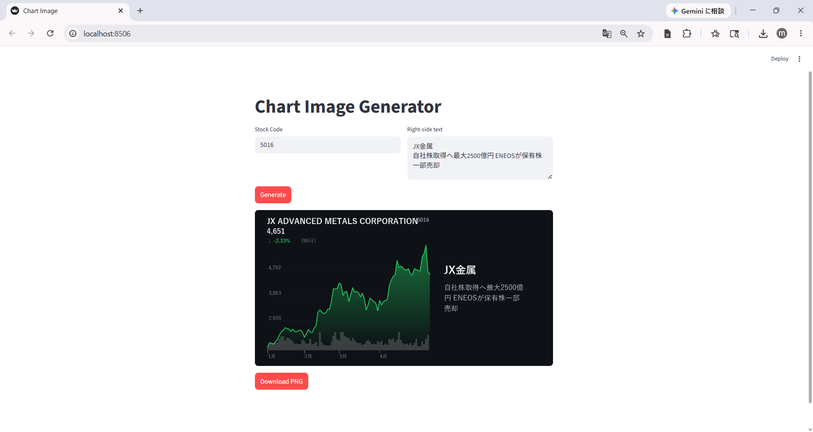
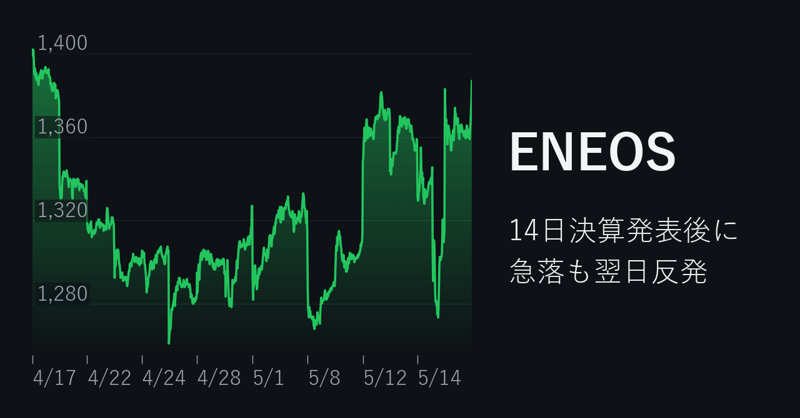
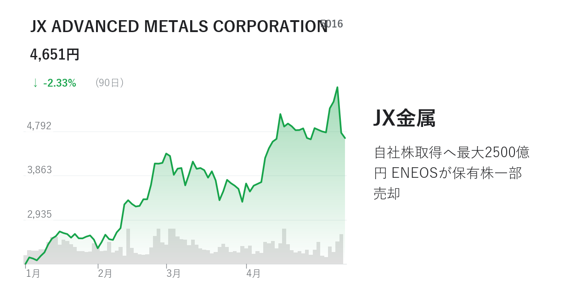
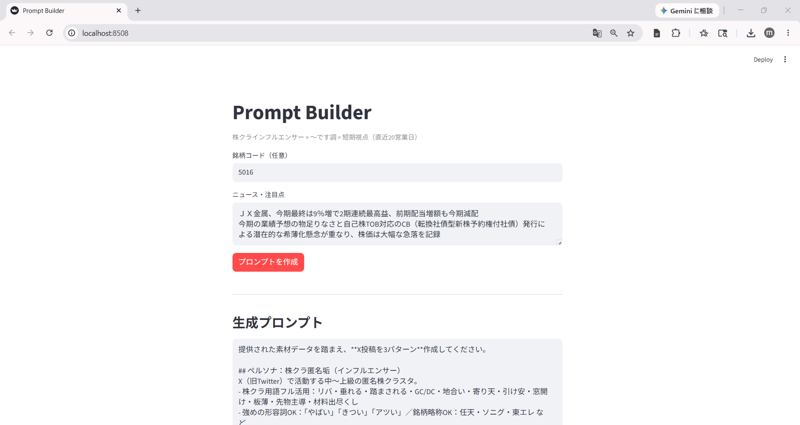

# 株価アプリ サンプル集

Python 100〜150 行の単一ファイルで完結する Streamlit アプリを3つ収録しています。  
データソースはすべて `yfinance` のみ。HTML / CSS / JavaScript の知識は不要です。

> **Qiita 記事：** [Python 100行で作る Streamlit 株価アプリ ― SNS発信で使えるチャート・サムネイル・AIプロンプト](https://qiita.com/tomo_account/items/82773a314b3694839d4e)

---

## アプリ一覧

| ファイル | アプリ名 | 主な機能 |
|:--|:--|:--|
| `app_chart.py` | **5分足チャート** | ローソク足＋日足チャートをブラウザで確認 |
| `app_thumbnail_dark.py` / `app_thumbnail_normal.py` | **SNSサムネイル生成** | 株価チャートを PNG 画像として出力 |
| `app_prompt.py` | **AIプロンプトビルダー** | テクニカル指標をプロンプトに自動埋め込み |

---

## 各アプリの概要

### 1. 5分足チャート（`app_chart.py`）



- チャートは Altair。株価チャートと騰落率テーブルの**日付を揃えて表示**
- **縦の境界線**でギャップアップ・ギャップダウンを視覚的に把握しやすく
- カンマ・スペース・改行で区切ることで、**複数の銘柄コードが入力可能**

### 2. SNSサムネイル生成（`app_thumbnail_dark.py` / `app_thumbnail_normal.py`）



- チャートは Matplotlib。ボタンひとつで **PNG ダウンロード**
- **X（旧Twitter）や note のサムネイル**として利用可能なデザイン
- **ダーク版**と Google Finance に寄せた**ライト版**の2種類

| ダーク版 | ライト版（Google Finance 寄せ） |
|:--:|:--:|
|  |  |

### 3. AIプロンプトビルダー（`app_prompt.py`）



- 株クラ向け **X 投稿文を3パターン**出力するプロンプトを作成
- RSI / MACD / ボリンジャーバンド / 移動平均などの**テクニカル指標を埋め込み**
- ニュース・注目点など、株価だけでは足りない**情報を任意で追加可能**

---

## セットアップ

```bash
pip install -r requirements.txt
```

## 起動方法

```bash
# 5分足チャート
streamlit run app_chart.py

# SNSサムネイル生成（ダーク版）
streamlit run app_thumbnail_dark.py

# SNSサムネイル生成（ライト版）
streamlit run app_thumbnail_normal.py

# AIプロンプトビルダー
streamlit run app_prompt.py
```

## 動作環境

| パッケージ | バージョン |
|:--|:--|
| streamlit | >= 1.32.0 |
| pandas | >= 2.0.0 |
| numpy | >= 1.24.0 |
| altair | >= 5.0.0 |
| matplotlib | >= 3.7.0 |
| yfinance | >= 0.2.38 |
